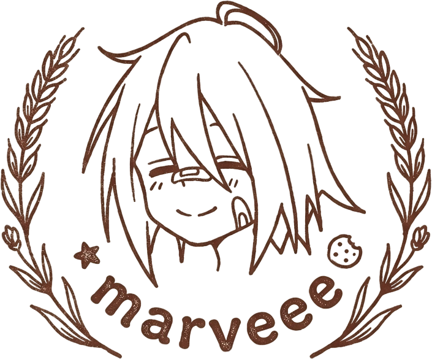

<div align="center">



# Ping-Pong

**Аркадный пинг-понг на Unity, играбельный прямо в браузере.**

[](https://unity.com)
[](https://docs.unity3d.com/Manual/webgl.html)
[](https://marveee3.itch.io/ping-pong)

[Особенности](#особенности) • [Режимы](#режимы) • [Управление](#управление) • [Запуск](#запуск) • [Сборка](#сборка-webgl) • [Структура проекта](#структура-проекта)

</div>

Ping-Pong — минималистичный аркадный пинг-понг в неоновом стиле. Мяч набирает скорость с каждым отбитием, а угол отскока зависит от точки удара по ракетке. Собран для WebGL и опубликован на itch.io.

> [!NOTE]
> Игра работает в любом современном браузере без установки — просто откройте страницу на [itch.io](https://marveee3.itch.io/ping-pong) и играйте.

## Особенности

- 🏓 **Три режима игры** — два игрока, игрок против ИИ и матч ИИ против ИИ
- ⚡ **Ускоряющийся мяч** — каждый отбитый удар повышает скорость вплоть до максимума
- 🎯 **Угловой отскок** — направление зависит от точки попадания по ракетке
- 🤖 **Честный ИИ** — компьютер следит за мячом с небольшой задержкой
- 🏆 **Счёт и экран победы** — матч до заданного количества очков, подсветка победителя
- 🎨 **Неоновый визуальный стиль** — светящиеся ракетки, стены и счёт
- 🎬 **Плавные переходы** — фейды между сценами и винтажная заставка при запуске
- 🖥️ **Адаптивная камера** — поле целиком в кадре при любом соотношении сторон экрана

## Режимы

| Режим | Описание |
| --- | --- |
| **P2P** | Игрок против игрока на одной клавиатуре |
| **P2AI** | Игрок против компьютера |
| **AI2AI** | Компьютер против компьютера — матч для наблюдения |

## Управление

| Действие | Клавиши |
| --- | --- |
| Игрок 1 (влево) | **W / S** |
| Игрок 2 (вправо) | **↑ / ↓** |
| Одиночный режим | **W / S** или **↑ / ↓** |
| Выход в меню | **Esc** |

## Запуск

Откройте проект в Unity 2022.3.16f1 и запустите сцену `Assets/Scenes/MainMenu.unity`.

> [!TIP]
> Каждая игровая сцена (`Game-P2P`, `Game-P2AI`, `Game-AI2AI`) автономна и может быть запущена напрямую — для тестирования конкретного режима.

## Сборка WebGL

Проект включает готовый скрипт сборки для командной строки:

```bash
/Applications/Unity/Hub/Editor/2022.3.16f1/Unity.app/Contents/MacOS/Unity \
  -batchmode -nographics -quit \
  -projectPath . \
  -executeMethod BuildWebGL.Build
```

Сборка появится в `Build/WebGL` (Brotli-сжатие, шаблон `NeonPong`, `webGLDecompressionFallback` включён — подходит для статического хостинга без специальных HTTP-заголовков).

## Структура проекта

```
Assets/
├── Editor/BuildWebGL.cs          # сборка WebGL из командной строки
├── Resources/                    # логотип заставки, звук удара
├── Scenes/                       # MainMenu, Game-P2P, Game-P2AI, Game-AI2AI, GameOver
├── Scripts/                      # логика игры
└── WebGLTemplates/NeonPong/      # кастомный WebGL-шаблон (сплэш, кнопка fullscreen)
```

### Ключевые скрипты

| Скрипт | Назначение |
| --- | --- |
| `BallMovement.cs` | физика мяча: разгон с каждым отбитием, повторный запуск |
| `BallBounce.cs` | отскоки от ракеток (угол по точке удара) и начисление очков |
| `Player.cs` | управление ракетками с клавиатуры |
| `RacketAi.cs` | ИИ: слежение за мячом с задержкой обновления |
| `ScoreManager.cs` | счёт, определение победителя, переход на экран результата |
| `SceneTransition.cs` | фейды между сценами, винтажная заставка, выход по Esc |
| `FitCameraToField.cs` | подгонка камеры под поле при любом aspect ratio |
| `WhoWin.cs` | подсветка победителя на экране результата |

## Технологии

- **Unity 2022.3.16f1** — игровой движок
- **C#** — логика игры
- **WebGL** — сборка для браузера (Brotli, UnityWebData)
